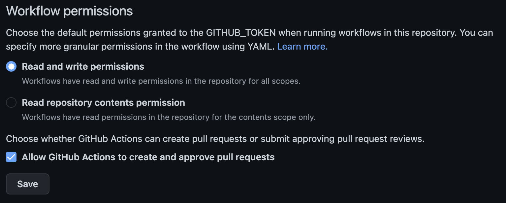

# Deployment to Github Pages via action (Beta, without orphan branch)
In this chapter you will learn how to build and automatically deploy your Angular application.

## Steps of the workflow
For building your angular application and deploy it to GitHub pages, you need to follow these steps:
1. Define an event (on push to master)
2. Setting up a token
3. Configure the workflow permissions
4. Run a container and configure the environment
5. Checkout the code
6. Install Node.js
7. Install dependencies
8. Build the application
9. Setup Pages
10. Upload artifact
11. Deploy to GitHub Pages

## Create the workflow
Create a file named `deploy-on-push-to-master.yml`.

## Define an event
For your workflow you need to define an event which triggers the deployment.
In this case a push to the `main` branch can be useful. Use the following code:
```yml
name: Deploy

on:
  push:
    branches:
      - 'main'
```
## Setting up a token
To enable the workflow to commit your built application to the `pages` branch, it needs the permissions to do so.

### GITHUB_TOKEN
For this you can use an automatically generated token called `GITHUB_TOKEN`.
To check the permissions go to your repository &rarr; Settings &rarr; Actions &rarr; General &rarr; Workflow permissions  

  

The permissions should be set to `Read and write permissions`

## Configure the workflow permissions

```yml
permissions:
  id-token: write
  pages: write
  deployments: write
```

## Run a container and configure the environment

```yml
jobs:
  docs:
    name: '🌍 Deploy'
    runs-on: ubuntu-latest
    environment:
      name: github-pages
      url: ${{ steps.deployment.outputs.page_url }}
```

## Checkout the code / Install Node.js / Install dependencies
These steps are the same, as in [running-tests workflow.](deployment-to-github-pages.md)

```yml
    steps:
      - name: '☁️ Checkout repository'
        uses: actions/checkout@v3

      - name: '⚙️ Use Node.js'
        uses: actions/setup-node@v3
        with:
          check-latest: true
          cache: 'npm'

      - name: '⛓️ Install dependencies'
        run: npm ci --no-optional --no-audit --prefer-offline --progress=false
```

## Build 
`npm run build --prod` will build the application and create a dist directory with a `Production build` of your project.
The code below will create the build step inside the workflow.

```yml
    - name: '🛠️ Build'
      run: npm run build --prod
```

## Setup Pages

```yml
      - name: Setup Pages
        uses: actions/configure-pages@v2
```

## Upload artifact

```yml
      - name: Upload artifact
        uses: actions/upload-pages-artifact@v1
        with:
          # dist directory of the application
          path: './dist/github-actions-tutorial/'
```

## Deploy to GitHub Pages

```yml
      - name: Deploy to GitHub Pages
        id: deployment
        uses: actions/deploy-pages@v1
```


## The workflow
```yml
name: Deploy

on:
  push:
    branches:
      - 'main'

permissions:
  id-token: write
  pages: write
  deployments: write

jobs:
  docs:
    name: '🌍 Deploy'
    runs-on: ubuntu-latest
    environment:
      name: github-pages
      url: ${{ steps.deployment.outputs.page_url }}

    steps:
      - name: '☁️ Checkout repository'
        uses: actions/checkout@v3

      - name: '⚙️ Use Node.js'
        uses: actions/setup-node@v3
        with:
          check-latest: true
          cache: 'npm'

      - name: '⛓️ Install dependencies'
        run: npm ci --no-optional --no-audit --prefer-offline --progress=false

      - name: '🛠️ Build'
        run: npm run build --prod

      - name: Setup Pages
        uses: actions/configure-pages@v2

      - name: Upload artifact
        uses: actions/upload-pages-artifact@v1
        with:
          # dist directory of the application
          path: './dist/github-actions-tutorial/'

      - name: Deploy to GitHub Pages
        id: deployment
        uses: actions/deploy-pages@v1
```